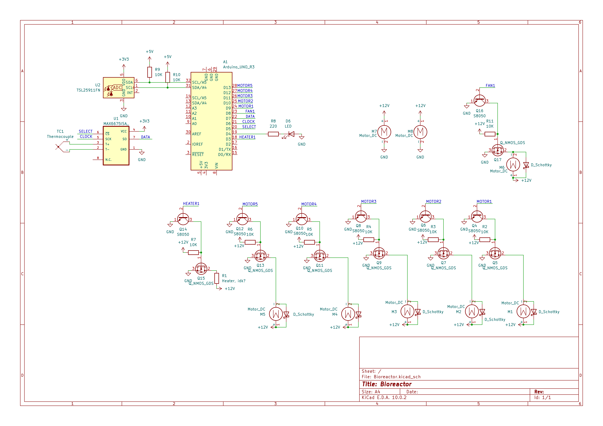
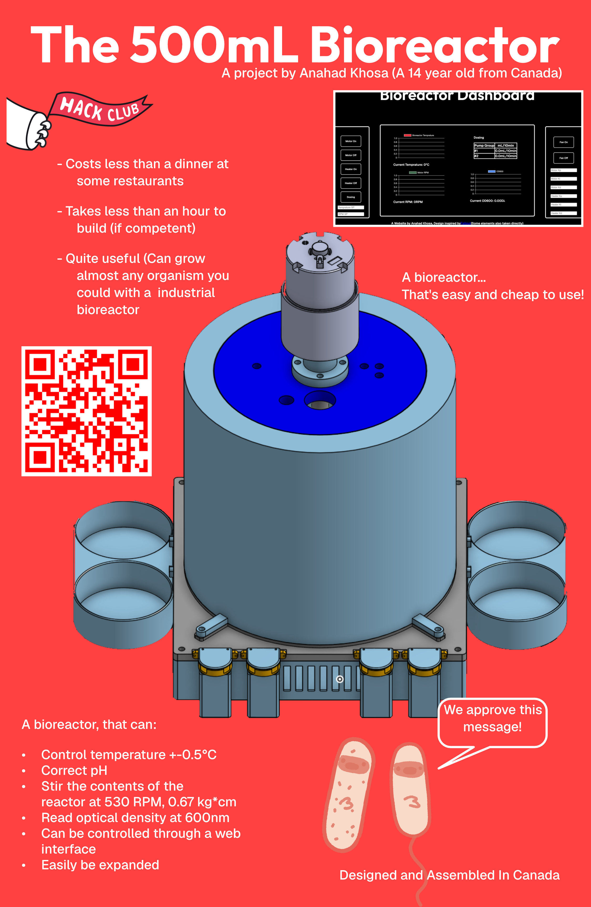

# Bioreactor?
This project is a expandable and usable bioreactor designed to allow **you** to grow bacteria, fungi, anything you can grow in a conventional bioreactor! Essencially this is a sterile volume, with ports or holes for instumentation (thermocouples, pH sensors, ect.) with software for controlling and managing the systems within. This bioreactor is unique (compared to other options at this price) by being very open and easy to build (some are open source, however they typically don't have great instructions on how to build your own.) Being very easily expandable, for example, extra slots are included if you want more motors, and it's easy to just add them (all design files are included.) And finally, being much larger than most other options (500mL.)

# Why?
Decentralized science is one of the most pivotal steps toward our future, wether it's finding a cure for an obscure disease (very unlikely), or providing resources to those who need it, decentralized science is the solution. Our project enables this, helping fuel a better future for us all. Perhaps one day someone will use it for something like producing insulin in areas that have limited outside access. The reason why I personally needed this is simple: I have a science fair that involves the growth of bacteria.

# Features
This bioreactor is a pretty full-fledged bioreaction system, it can grow almost any organism (that you could with a insustrial bioreactor), has dosing systems, optical density measurments, temprature control and a online, accessible UI. The only thing that this bioreactor can't handle is significant pressure differentials, as it's just not meant for that.

## BOM
| Name                              | Purpose                                                                                                                                                                                                                             | Quantity                               | Total Cost (USD) | Link                                                                                                                             | Distributor |
| --------------------------------- | ----------------------------------------------------------------------------------------------------------------------------------------------------------------------------------------------------------------------------------- | -------------------------------------- | ---------------- | -------------------------------------------------------------------------------------------------------------------------------- | ----------- |
| Perfboard                         | It is used to connect everything together.                                                                                                                                                                                          | 1                                      | 8.00             | https://www.amazon.ca/Protoboard-Solderable-Breadboard-Electronics-Projects/dp/B0B9F2DNXD/                                       | Amazon      |
| Schottky Diodes (Pack of 10)      | The Schottky diodes are so that the MOSFET doesn't burn out due to back EMF.                                                                                                                                                        | 1                                      | 3.41             | https://www.aliexpress.com/item/1005007566611868.html                                                                            | Aliexpress  |
| 500mL Media Storage Bottle        | It shall be used to contain the media in which the biological processes are happening.                                                                                                                                              | 1                                      | 30.00            | https://stonylab.com/products/250ml-wide-mouth-media-storage-bottle?variant=47202194620674                                       | StonyLab    |
| CoPA filament                     | It is to print some parts that will either be exposed to warm temperatures and that will be contacting the media (for sterilization reasons.) And yes you only need a few hundred grams but this is the smallest size I could find. | 1                                      | 43.70            | https://www.amazon.ca/gp/product/B09MTC51RH/                                                                                     | Amazon      |
| 20x20x6mm fan                     | This fan is used to pass air through the PTFE filter, a high airflow isn't required for my perposes but you may need it.                                                                                                            | 2                                      | 3.72             | https://www.aliexpress.com/item/1005009082132202.html                                                                            | Aliexpress  |
| S8050                             | It is used to switch the MOSFET on and off,                                                                                                                                                                                         | 1, Pack of 20                          | 1.40             | https://www.aliexpress.com/item/1005008583538092.html                                                                            | Aliexpress  |
| IRFZ44N                           | The MOSFET is used both for motor control, and for the control of the heater.                                                                                                                                                       | 1, Pack of 10                          | 2.42             | https://www.aliexpress.com/item/1005007580466441.html                                                                            | Aliexpress  |
| Thermal Paste                     | The thermal paste is so that the heater pad and the media container can have proper conduction, as otherwise heat transfer would be poor.                                                                                           | 1                                      | 8.74             | https://www.amazon.ca/Thermal-Grizzly-Kryonaut-Grease-Paste/dp/B011F7W3LU/                                                       | Amazon      |
| MAX6675                           | It is so that I may use the thermocouple in coordination with the Arduino.                                                                                                                                                          | 1                                      | 6.50             | https://www.amazon.ca/MAX6675-Thermocouple-Temperature-Sensor-Module/dp/B07YC25RFW/                                              | Amazon      |
| Type K thermometer                | It is used for PID control and data collection.                                                                                                                                                                                     | 1                                      | 8.74             | https://www.amazon.ca/MECCANIXITY-Surface-Thermocouple-Handheld-Temperature/dp/B0CCSKDCW3/                                       | Amazon      |
| Geared Motor                      | It is used in order to stir the media, allowing equal dispersion of materials and organisms.                                                                                                                                        | 1                                      | 15.60            | https://www.aliexpress.com/item/1005010720335071.html                                                                            | Aliexpress  |
| Silicone Heating Pad 12V/40W      | It is used for heating and maintaining the temperature of the media.                                                                                                                                                                | 1                                      | 10.00            | https://www.aliexpress.com/item/1005005338245057.html                                                                            | Aliexpress  |
| 12V/15A Power Supply              | I shall use this PSU for powering the Bioreactor's systems.                                                                                                                                                                         | 1                                      | 19.67            | https://www.aliexpress.com/item/1005011601037869.html                                                                            | Aliexpress  |
| Arduino R4 WiFi                   | The Arduino WiFi is used for the control of biological processes (pH control, temperature control, ect.) and for communications through MQTT and a python API.                                                                      | 1                                      | 27.50            | https://store-usa.arduino.cc/collections/uno/products/uno-r4-wifi                                                                | Arduino     |
| 5mm LED                           | The light emitting diodes are used to pass light through ~1cm of media and calculate the OD600.                                                                                                                                     | 1, Pack of 100 (smallest I could find) | 6.50             | https://www.amazon.ca/gp/product/B09BPQWV2W/                                                                                     | Amazon      |
| Adafruit TSL2591                  | Used to measure the intensity of light on the other side of the media, thus allowing the calculation of OD600.                                                                                                                      | 1                                      | 6.95             | https://www.digikey.ca/fr/products/detail/adafruit-industries-llc/1980/4990786                                                   | DigiKey     |
| 25mm PTFE Filters, Hydrophillic   | Used to prevent contaminants like bacteria and water from getting into the reactor vessel                                                                                                                                           | 1, Pack of 50 (minimum size)           | 12.90            | https://www.amazon.ca/Deschem-Hydrophilized-Membrane-Filter-Polytetrafluoroethylene/dp/B07TC2RQYN                                | Amazon      |
| 3m 18mm OD 14mm ID Sillicone Tube | Used to move air through a filter into the bioreactor, allowing the growth of aerobic bacteria.                                                                                                                                     | 1                                      | 6.50             | https://amazon.ca/silicone-flexible-rubber-tubing-transparent/dp/b08hjgwkx3/?th=1                                                | Amazon      |
| 5.4mm Luer fittings female        | Used to allow a sterile connection that can move fluids, very useful for doising and extraction.                                                                                                                                    | 1                                      | 4.90             | https://www.amazon.ca/Hynec-Polypropylene-Female-Luer-Connector/dp/B0F1ZX2S71?source=ps-sl-shoppingads-lpcontext&ref_=fplfs&th=1 | Amazon      |
| Luer tube                         | Used to move fluids in a sterile way between the reagent tubes and the vessel.                                                                                                                                                      | 4                                      | 7.20             | https://www.aliexpress.com/item/1005005528071293.html                                                                            | Aliexpress |

(The reason the prices are in USD is because origonally this project was for Stasis, however I migrated before I really started doing most of the coding and design.) Another note, I'm not requesting funding for all of these since I have a lot of the parts.

# Usage
The usage of this bioreactor is pretty simple, after assembly, connect it to the internet (you can put in your WiFi password by just adding it to the "secrets.h" file.) After this, just turn on the PSU, and connect to it on the internet. The process by which you connect everything together, and set up the web UI is detailed in the instructions.

# Requirements/Libraries
For this project to work you will need to download the following libraries:

## Arduino

- PID (https://github.com/br3ttb/Arduino-PID-Library/tree/master)
- MAX6675 (https://github.com/RobTillaart/MAX6675)
- functional (included with Arduino IDE)
- WiFiS3 (included with Arduino IDE)
- ArduinoMqttClient (https://github.com/arduino-libraries/ArduinoMqttClient)
- RTC (https://github.com/cvmanjoo/RTC)
- Adafruit_Sensor (https://github.com/adafruit/adafruit_sensor)
- Adafruit_TSL2591 (https://github.com/adafruit/Adafruit_TSL2591_Library/)
- HttpClient (https://github.com/amcewen/HttpClient)
- Wire (Included with Arduino IDE)

## Python
- FastAPI (https://github.com/fastapi/fastapi)

# Disclamer
While I made most of this project myself, I obviously didn't create certain things like the libraries. I also used resources like StackOverflow for this. Another thing to note, I did not create the original models for the ported caps and the headplate, I simply _**CANNOT**_ make threads for some reason.

## Refrences I Used
- Python Docs
- Javascript MDN Docs
- ElectroNoobs (https://electronoobs.com/)
- Examples (The files that are included with most libraries, showing how to use them)
- StackOverflow
- W3, for learning (I'm still new to this stuff)

# Schematic

# Zine

# Onshape Links
Here are the onshape links if you want them
- For the Arduino Enclosure, the motor holder, reagent bottle holder and the assembly of everything put together https://cad.onshape.com/documents/7da2fef4892da00e546072ac/w/9fd6f0965d1d0b5f1b6a90d1/e/e24ce9c144e045758d9770eb?renderMode=0&uiState=6a1cae62712d3547b38f36be
- For the heater holder, the motor shaft, and motor holder https://cad.onshape.com/documents/63b4c3fef69abd726d6ab222/w/4431f9c62b980bae8326396e/e/164de285b85071f5c7627032?renderMode=0&uiState=6a1caf96e76f9782594c37a5
- Reagent bottle cap with 2 ports https://cad.onshape.com/documents/1eed58fe4840c910f07571ab/w/ff7b350df8e7dc2f2e59ebc7/e/ee4f5e3626b7f9089b5a21a8?renderMode=0&uiState=6a1cafdfe116a2d386ec4e54
- Headplate, used to mount sensors and the motor https://cad.onshape.com/documents/97e268ccdf9d28071c848c08/w/29b871e1c28c8c8f8ed3ce92/e/f98ecdd4111ee4c6ba3b3adb?renderMode=0&uiState=6a1cb03574e0b41a2494a02a